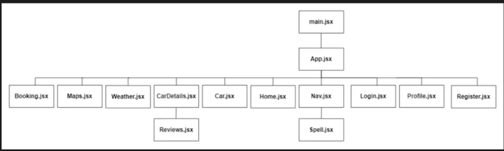
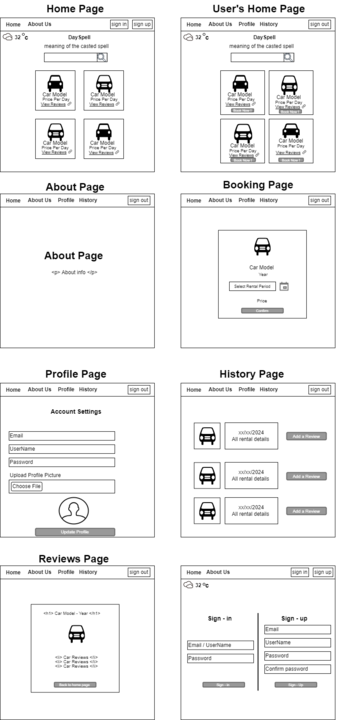

# Cars-Cast

## Date : 10/06/2024

### Group Members:

Hussain Al Aradi | Sara Alalawi | Maryam Almutawa

### **_About the project_**

---

#### Our App

With our app, you can browse through a diverse fleet of cars, and book your ride with just a few taps !
A registered user can enjoy a seamless booking, flexible rental durations and transparent pricing. Also, the user-freindly interface allows the website visitors to register smoothly and gain more previliges and options within the website instead of only viewing the cars information.

### **_Design Phase_**

#### Entity-Relationship Diagram (ERD):

#### Components Diagram:

#### Wireframe:

---

### **_Managment of The Workflow_**

[View workflow details here](https://trello.com/b/WEyWLKfp/cast-cars-project)

---

### **_Used Technologies_**

**_1) Backend Development:_**

- **_Node.js_**
- **_Express.js_**
- **_MongoDB_**

**_2) Frontend Development:_**

- **_React.js_**

---
### **_Future Updates_**

- [x] add weather APi
- [ ] add colorpicker to allow the user to select the background color of the website(during the seasion)
- [x] Spell of the day api
- [x] have nice UX
- [x] add booking calander
- [ ] maybe GPS to track the user  to benefit. 

---
### **_Credits_**

[Trello](https://trello.com/) |
[Draw io](https://app.diagrams.net/) | [SEI-09-public-apis](https://github.com/SEI-09-Bahrain/public-apis)
